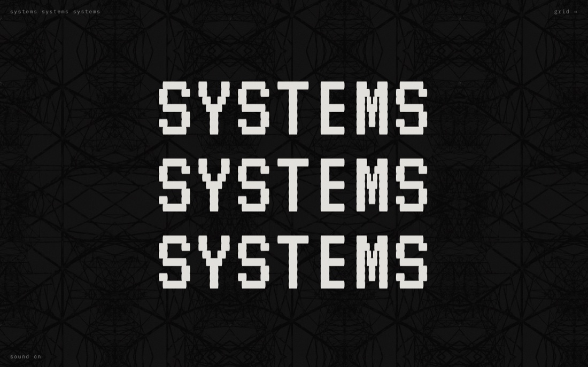
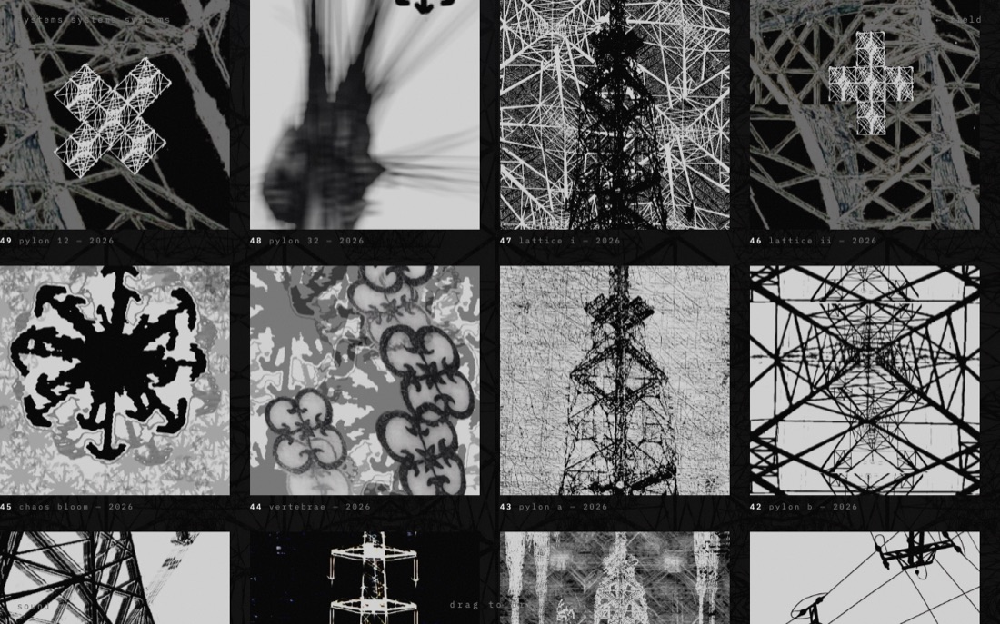

# systemssystemssystems

**live at [systemssystemssystems.faith](https://systemssystemssystems.faith/)**

a gallery of generated structures — pylons, lattices, blooms — with a CRT-photocopy soul.
plain HTML, CSS, and JavaScript. no framework, no build step, no dependencies.

| | |
|---|---|
|  |  |
| **the field** — scattered pieces that migrate | **the grid** — an endless drag-to-drift sheet |

## the two rooms

- **the field** (`index.html`) — every piece scattered across a long, slow scroll. Each one
  dissolves and reappears somewhere new on its own clock, hums between opacities, and fizzes with
  static as the cursor approaches. Scroll parallax drifts them at different speeds — and scrolling
  itself is deliberately heavier than a normal page: wheel and touch are damped and speed-capped so
  the works drift past rather than fly (keyboard and scrollbar stay native; `prefers-reduced-motion`
  gets an ordinary page). Click any piece for the full-resolution lightbox.
- **the grid** (`grid.html`) — the full set in strict rows and columns, repeating endlessly in every
  direction. Drag, flick, or scroll-wheel to pan; space wraps invisibly on both axes (the sheet is a
  3×3 patchwork of identical copies and the camera teleports by exactly one copy whenever it crosses
  one). On a keyboard, `Tab` walks the tiles and the sheet pans to follow.
- **the hum** (both rooms, bottom corner) — an optional synthesized mains drone: 50 Hz and harmonics
  over a dark noise bed, breathing slowly. Phones get the same soul re-voiced up an octave or two,
  since phone speakers can't say 50 Hz. Lingering on a piece quickens it. Off until asked for.

Motion, static, and migration all stand down when the visitor has `prefers-reduced-motion` set.

## repo map

| file | what it is |
|---|---|
| `works.js` | **the manifest — the only file that changes day-to-day.** One entry per artwork, newest at the top. Kept at the root on purpose: it's content, not code. |
| `index.html`, `grid.html`, `404.html` | the pages (Pages requires these at the root) |
| `assets/js/field.js` | the field: banded placement, responsive sizing, migration, parallax, cursor static |
| `assets/js/grid.js` | the grid: the 3×3 wrap trick, drag/flick/wheel camera, keyboard pan |
| `assets/js/scroll.js` | the weighted scroll: damped, speed-capped wheel/touch on the field |
| `assets/js/lightbox.js` | shared by both pages: the lightbox, HTML-escaping, thumb resolution |
| `assets/js/sound.js` | the hum, synthesized live with WebAudio |
| `assets/css/site.css` | all styling; palette variables at the top, mobile overrides at the bottom |
| `images/` | **the originals. these are the artworks — never resized, recompressed, or renamed.** |
| `images/thumbs/` | generated inline derivatives + `index.js` manifest (see below) |
| `tools/make-thumbs.sh`, `tools/make-thumbs.ps1` | regenerate `images/thumbs/` with native macOS or Windows tooling |
| `.github/workflows/thumbnails.yml` | tests a clean thumbnail generation on both macOS and Windows |
| `docs/` | README screenshots |
| `CNAME`, `.nojekyll`, favicons | GitHub Pages plumbing (root by convention) |

## adding a work

1. Drop the image into `images/` (any name; `.png` / `.jpeg`; the exact filename including case is
   what the site will request — GitHub Pages is case-sensitive).
2. Add one line at the **top** of `works.js`:
   ```js
   { src:"images/ar.png", title:"pylon ar", year:"2026" },
   ```
   Numbering is derived automatically (newest = highest number), so nothing else needs renumbering.
3. Regenerate thumbnails with the native script for your platform:

   macOS, or Windows from Git Bash:

   ```sh
   ./tools/make-thumbs.sh
   ```

   Windows PowerShell:

   ```powershell
   .\tools\make-thumbs.ps1
   ```
4. Check it locally (below), then commit and push `main`. GitHub Pages deploys in about a minute.

Skipping step 3 never breaks the site — a work without a thumb simply serves its original file,
full weight, until the script next runs.

## thumbnails

The originals total tens of megabytes, and the grid page renders the whole set nine times over, so
the pages display generated derivatives (max 1400 px, opaque images as JPEG, transparent ones as
PNG) and save the originals for the lightbox. `images/thumbs/index.js` maps original → thumb; a
thumb only earns a manifest entry by being genuinely smaller than its original. Everything under
`images/thumbs/` is disposable output — regenerate it, never hand-edit it.

Neither generator installs dependencies: macOS uses `sips`, while Windows uses `System.Drawing`.
GitHub Actions deletes the checked-in derivatives, regenerates them independently on both operating
systems, confirms the originals stayed untouched, and validates every generated mapping.

## running locally

Any static server from the repo root:

```sh
python3 -m http.server 4173
# → http://localhost:4173
```

(Opening `index.html` as a `file://` URL mostly works but serves no thumbs manifest cleanly and
skews font/audio behavior — use a server.)

## hosting

GitHub Pages, from the `main` branch of
[`systemssystemssystems/systemssystemssystems.github.io`](https://github.com/systemssystemssystems/systemssystemssystems.github.io),
on the custom domain in `CNAME` (`systemssystemssystems.faith`, apex A-records + `www` CNAME →
redirect). `.nojekyll` tells Pages to serve the files as-is. Pushing to `main` **is** deploying.

## design notes

- palette lives in `:root` in `assets/css/site.css` — `--ground` near-black, `--bone` off-white,
  `--dim` gray, `--hot` white. Everything lowercase; VT323 for the title tower, IBM Plex Mono for
  everything else.
- layout of the field is seeded (`mulberry32(20260713)`) so first paint is identical for everyone;
  the *migrations* afterward are truly random. Every host piece owns one vertical band of the
  field, so density stays even — no voids, no pile-ups — and sizes are rolled in `vw` but clamped
  in `px` per device tier (phone / tablet / desktop), so the work reads properly from a phone to an
  ultrawide. Width changes re-place the field after a short debounce so breakpoint changes take
  effect without a reload.
- all text is decoration-light: corner marks, tiny letterspaced captions, no chrome.

## images

All artwork © systemssystemssystems. The code is trivial; the images are not — please don't reuse
them without permission.
